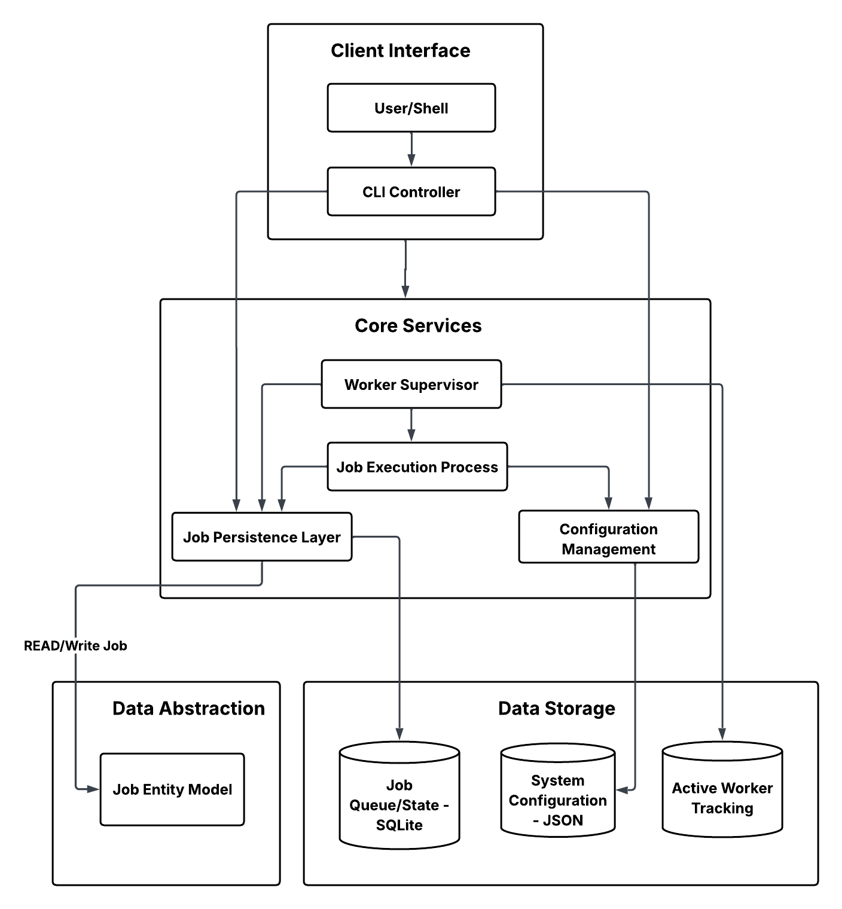

# QueueCTL - Background Job Queue System

A production-grade CLI-based background job queue system with parallel workers, automatic retries, and Dead Letter Queue support.

## 🚀 Features

- ✅ **Parallel Workers** - Process multiple jobs simultaneously
- ✅ **Automatic Retries** - Exponential backoff retry mechanism
- ✅ **Dead Letter Queue** - Handle permanently failed jobs
- ✅ **Persistent Storage** - SQLite database survives restarts
- ✅ **Thread-Safe** - Row-level locking prevents race conditions
- ✅ **Configurable** - Customize retry count and backoff settings

## 📦 Installation

```bash
# Clone the repository
git clone <https://github.com/sripriyakonjarla/QueueCTL_CLI-based-background-job-queue-system>
cd QUEUECTL

# Install dependencies
pip install -r requirements.txt

# Install the package
pip install -e .
```

## 💻 Usage

### Enqueue Jobs

```bash
queuectl enqueue '{"id":"job1","command":"echo Hello World"}'
queuectl enqueue '{"id":"job2","command":"sleep 2"}'
```

### Manage Workers

```bash
# Start a single worker
queuectl worker start

# Start multiple workers for parallel processing
queuectl worker start --count 3

# Stop all workers
queuectl worker stop
```

### Monitor Jobs

```bash
# Check queue status
queuectl status

# List all jobs
queuectl list

# List jobs by state
queuectl list --state pending
queuectl list --state completed
```

### Dead Letter Queue

```bash
# List failed jobs in DLQ
queuectl dlq list

# Retry a failed job
queuectl dlq retry job1
```

### Configuration

```bash
# Set retry configuration
queuectl config set max-retries 5
queuectl config set backoff-base 2

# View configuration
queuectl config get
```

## 🏗️ Architecture



### Job Lifecycle

```
pending → processing → completed
              ↓
           failed → (retry with backoff) → dead (DLQ)
```

### Retry Mechanism

Exponential backoff: `delay = base ^ attempts` seconds

**Example** (backoff_base = 2):
- Attempt 1: 1 second
- Attempt 2: 2 seconds  
- Attempt 3: 4 seconds
- After max_retries → DLQ

### Data Storage

- **Database**: `queuectl.db` (SQLite)
- **Configuration**: `~/.queuectl/config.json`
- **Worker PIDs**: `~/.queuectl/workers.pid`

## 🧪 Testing

```bash
python test_queuectl.py
```

**Tests cover:**
- ✅ Job completion
- ✅ Retry mechanism with exponential backoff
- ✅ Parallel worker processing
- ✅ Data persistence
- ✅ Dead Letter Queue functionality

## 📋 Quick Start Example

```bash
# Enqueue multiple jobs
queuectl enqueue '{"id":"job1","command":"echo Task 1"}'
queuectl enqueue '{"id":"job2","command":"echo Task 2"}'
queuectl enqueue '{"id":"job3","command":"echo Task 3"}'

# Start 3 workers for parallel processing
queuectl worker start --count 3

# Check status
queuectl status

# View completed jobs
queuectl list --state completed
```

## ⚙️ Configuration

**Default Settings:**
- `max_retries`: 3
- `backoff_base`: 2

Configuration persists in `~/.queuectl/config.json`

## 🔑 Key Design Decisions

- **SQLite**: Zero-configuration persistence, suitable for moderate workloads
- **Multiprocessing**: True parallelism without GIL limitations
- **Row-Level Locking**: Prevents race conditions in concurrent job processing
- **Exponential Backoff**: Reduces load during transient failures
- **5-Minute Timeout**: Prevents jobs from hanging indefinitely

## 🐛 Troubleshooting

**Workers not processing jobs?**
```bash
queuectl status  # Check if workers are running
queuectl list --state pending  # Verify pending jobs exist
```

**Jobs stuck in processing?**
- Restart workers: `queuectl worker stop && queuectl worker start`

**Database locked errors?**
- Ensure only one QueueCTL instance accesses the database at a time

## 🎥 Demo Video

[Watch the demo video](https://drive.google.com/your-demo-link)